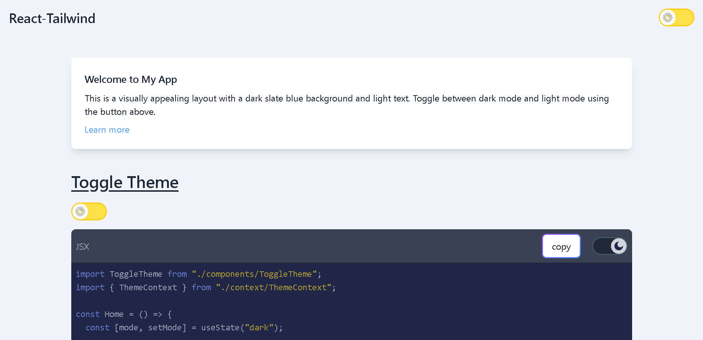
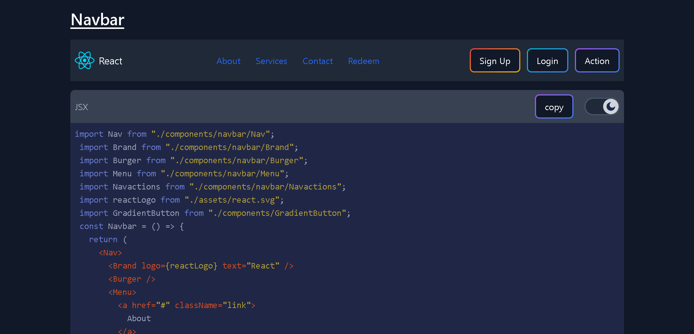

# React ~ Tailwind

<p align="center">
   
   
</p>

# Toggle Theme (dark mode/light mode)

<p align="center">
   
   
   
</p>

## What you should do:

You should use react context or any state management strategy to provide the current theme state (i.e. either dark mode or light mode). This step makes sense if you are using tailwind class strategy for managing the theme. The end goal of this step is to create a wrapper div with className that is equal to the current theme (either "dark" or "").

## What you don't need to do:

The element `<ToggleTheme mode={mode} setMode={setMode}\>` is provided as an export so you do not need to hardcode it. You have to provide `mode` and `setMode` however which are created using `useState`.

PS: In my opinion using context makes the DX easier. If you are using Next.js then the fact that you have to use a client component for your wrappers shouldn't scare you away because client components can have server component children. I am not an expert on this topic but the following link can certainly help:
[Client components having server rendered children?](https://github.com/vercel/next.js/discussions/43153)

[Tailwind css dark mode `class` strategy](https://tailwindcss.com/docs/dark-mode#toggling-dark-mode-manually)

[Learn React Context](https://react.dev/learn/passing-data-deeply-with-context)

### Example code:

```jsx
import ToggleTheme from "./components/ToggleTheme";
import { ThemeContext } from "./context/ThemeContext";

const Home = () => {
  const [mode, setMode] = useState("dark");

  return (
    <ThemeContext.Provider value={mode}>
      {/* code ... */}
      <div className={mode}>
        <div className="dark:bg-gray-900 bg-slate-100 min-h-screen dark:text-gray-400 text-gray-800 transition-colors duration-300">
          <header className="p-4">
            <nav className="flex justify-between items-center">
              <h1 className="text-2xl font-semibold dark:text-white">
                React-Tailwind
              </h1>
              <ToggleTheme mode={mode} setMode={setMode} />
            </nav>
          </header>
          {/* code ... */}
        </div>
      </div>
      {/* code ... */}
    </ThemeContext.Provider>
  );
};
```
